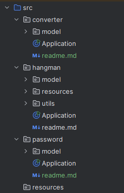

# Тестовое задание для курса "_Java с 0_" от [_СЕНЛА_](https://xn--80ajshs.xn--p1ai/courses/)

## Выполнил: _Фокин Владимир_

### Что нужно сделать: 

>Выполни 3 задания и добавь их в Git-репозиторий одним проектом. 
Убедись, что доступ к выполненному заданию открыт для просмотра. 
В файле ReadMe в репозитории укажи свою фамилию и имя.

### Требования:
- Задания должны быть выполнены на языке Java.
- Решение каждой задачи должно лежать в отдельном пакете проекта с отдельным методом public static void main.
- Приветствуется соответствие принципам ООП и сильного сцепления.
- Все сообщения должны быть выведены пользователю в консоль с помощью метода System.out.print(ln).

### Описание

В каждом пакете находится файл ```Application.java``` 
со стартовым методом ```main```, который запускает основную логику программы.

**Названия пакетов:**
- _hangman_ - Игра "Виселица"
- _converter_ - Курс валют
- _password_ - Генератор паролей

Также в каждом пакете присутствует отдельный файл ```readme.md``` 
с кратким описанием всех классов и примером выполнения каждой задачи.



