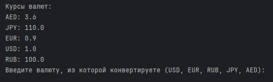
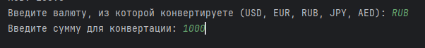
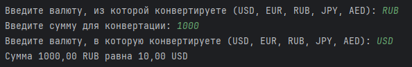

# ЗАДАНИЕ 2

## Курс валют

### Задание №2. Курс валют

Создай консольное приложение, которое запрашивает у пользователя сумму 
в одной валюте и конвертирует её в другие валюты по фиксированному 
количеству обменных курсов. Курсы обмена валюты задавать в виде чисел 
с плавающей точкой. Курсы можно задать внутри кода программы как константы 
или один раз запрашивать при запуске программы и потом использовать их 
в течение всей ее работы. Пяти валют будет достаточно для реализации.

### Описание классов
- ```Application.java``` - Стартовый класс с методом main()
- ```ConsoleConverter.java``` - Реализует основную логику программы
- ```Currency.java``` - Включает в себя хранение констант валют, основной метод
для конвертации валюты и вывода информации на экран. Также несколько методов
для проверки введенной информации.

### Работа программы

1. При запуске программы, на экран выводятся присутствующие валюты, 
и от пользователя требуется ввести валюту, из которой нужно конвертировать

\

2. После требуется ввести сумму, которую требуется конвертировать 



3. И валюту, в которую нужно конвертировать



4. После в консоль будет выведена конвертированный результат 


