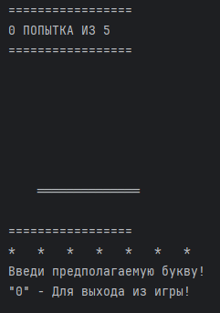
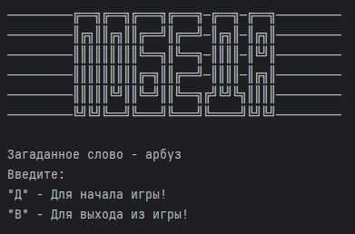

# ЗАДАНИЕ 1

## Виселица / Hangman

### Задание №1. Игра «Виселица»

Реализуй игру «Виселица», где игрок пытается угадать слово, вводя одну букву за раз. 
Если буква отсутствует в слове, то игрок теряет жизнь. Игра заканчивается, 
когда игрок угадывает слово или теряет все жизни. Слово для отгадывания выбирать 
случайно из списка слов-констант внутри программы. После каждой введенной буквы 
выводить в консоль загадываемое слово с пропусками букв и сообщение о том, 
сколько жизней осталось. Рисовать в консоли человечка на виселице как иллюстрацию 
количества жизней (как это обычно бывает в «Виселице») не обязательно, но будет приветствоваться.

### Описание классов
- ```Application.java``` - Стартовый класс с методом main()
- ```ConsoleHangman.java``` - Реализует запуск игры и поддерживает её в цикле до завершения
- ```Session.java``` - Класс реализации игровой сессии. В нем описана вся логика игры и проверочные условия
- ```InfoGenerator.java``` - Реализует методы для генерации игровых параметров. В нашем случае загаданное слово и хранение алфавита
- ```Dictionary.java``` - Класс, в котором реализуются методы для взаимодействия со словарем или словарями
- ```Messages.java``` - Статичный класс для вывода различных заготовок текстовой информации в консоль

### Работа программы

"_Виселица_" выполнена на русском языке.

1. При запуске приложения будет предложен выбор начать игры.


2. При вводе значения "д", сразу же начинается игровая сессия


3. Постепенно, при вводе различных вариантов, будут открываться скрытые буквы или строиться "виселица". 
Если введенное значение уже использовалось, то выведется табличка со всеми неиспользованными буквами


4. При выигрыше, игрока встретит соответствующая надпись и предложение сыграть еще одну игру


5. В случае поражения, появится достроенная "виселица" с погибшим "игроком". 
И также предложение сыграть еще одну партию


