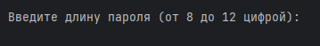
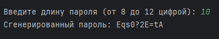

# ЗАДАНИЕ 3

## Генератор паролей

### Задание №3.

Напиши программу, которая генерирует случайный безопасный 
пароль длиной от 8 до 12 символов. Пароль должен содержать 
заглавные и строчные буквы, цифры и специальные символы. 
Предоставь пользователю возможность выбрать длину пароля.

### Описание классов
- ```Application.java``` - Стартовый класс с методом main()
- ```ConsolePassword.java``` - Реализует оболочку в виде цикла для основной логики программы
- ```PasswordGenerator.java``` - Включает в себя метод для генерации случайного пароля 
из требуемых символов и после перемешивает их между собой 

### Работа программы

1. При запуске программы требуется ввести длину пароля для генерации (от 8 до 12 символов)



2. После введенного значения автоматически генерируется случайный пароль и выводится в консоль




